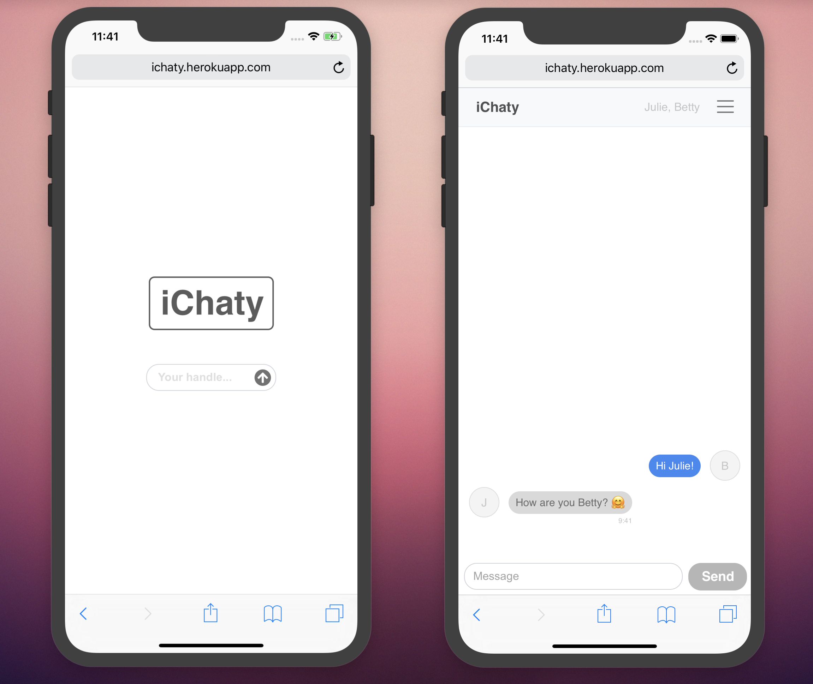

# iChaty [[Demo](https://ichaty.herokuapp.com)]

Chat application built using nodeJs, socket.io and React. You can connect with your friends and chat in multiple rooms, add friends to chat rooms or send messages to them individually.

To get started:

1. `yarn`
2. `yarn dev`

